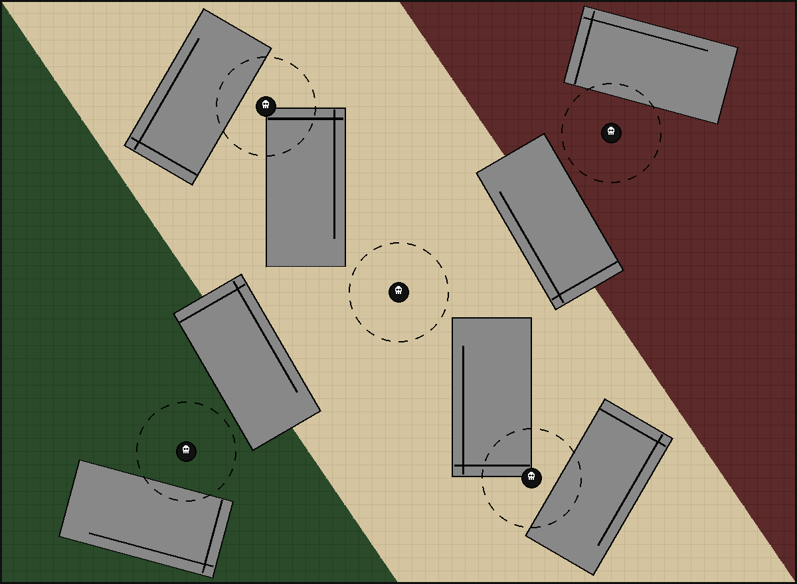

# Carltographer

A terrain layout generator for Warhammer 40k. Given a collection of terrain
pieces and a table size, Carltographer uses a genetic algorithm to produce
balanced, playable layouts — optimizing for piece counts, spacing, and
line-of-sight coverage.

**[Download the latest release](https://github.com/khaaarl/carltographer/releases/latest)** — pre-built executables are available for Windows, macOS (Apple Silicon), and Linux. No installation required, just download and run.

> **Note:** Because the executables aren't signed, your OS may show a warning
> the first time you run it. This is normal for independent software.
> - **Windows:** If you see "Windows protected your PC", click **More info**,
>   then **Run anyway**.
> - **macOS:** If you see "can't be opened because it is from an unidentified
>   developer", right-click (or Control-click) the app and choose **Open**,
>   then click **Open** in the dialog.



## Features

- **Genetic algorithm** with parallel tempering (simulated annealing across
  multiple temperature chains) to escape local optima and find better layouts
- **Visibility scoring**: angular-sweep line-of-sight analysis evaluates overall
  table visibility, per-deployment-zone visibility, cross-zone sightlines, and
  objective hidability
- **Mission support**: 10th Edition deployment zones and objective markers
  (Hammer and Anvil, Dawn of War, etc.) displayed on the layout
- **Rotationally symmetric** mode mirrors terrain at 180° for balanced gameplay
- **Configurable constraints**: min/max feature counts, minimum spacing between
  terrain and from table edges, visibility targets with weights
- **Deterministic**: same seed always produces the same layout, even across
  Python and Rust engines
- **Dual-engine**: reference Python engine and a Rust engine (via PyO3) with
  verified bit-identical output for the same seed
- **Tkinter GUI** with 2D top-down battlefield viewer, deployment zone overlay,
  objective markers, and save/load

## Quick Start

### From a packaged executable

Download a pre-built binary for your platform from the
[latest release](https://github.com/khaaarl/carltographer/releases/latest).
Run it directly — no Python or Rust installation needed.

### From source

Requires Python 3.12+ and optionally Rust (for the faster engine).

```bash
# Clone and set up
git clone <repo-url>
cd carltographer/v2
python -m venv .env
source .env/bin/activate
pip install -r requirements.txt

# Run the UI
./scripts/run-ui.sh

# (Optional) Build the Rust engine for ~10x faster generation
pip install maturin
python scripts/build_rust_engine.py
```

The app auto-selects the Rust engine when available and verified; otherwise it
falls back to the Python engine transparently.

## How It Works

1. **Define your terrain**: A JSON terrain catalog describes available pieces
   (crates, ruins, walls, etc.) with their geometric shapes and quantities.

2. **Set parameters**: Table size, seed, mutation steps, spacing constraints,
   feature count preferences, visibility targets, and mission/deployment zone.

3. **Generate**: The engine starts with an empty table and iteratively mutates
   the layout — adding, moving, deleting, replacing, and rotating terrain
   pieces. Each mutation is scored and the best layout is kept.

4. **Optimization**: Parallel tempering runs multiple chains at different
   "temperatures". Hot chains explore freely (accepting worse layouts), cold
   chains refine greedily. Periodic replica swaps let good solutions found by
   hot chains migrate to the cold chain for polishing.

5. **Scoring** happens in two phases:
   - *Phase 1*: Drive toward target feature counts (min/max per type)
   - *Phase 2*: Optimize visibility metrics (overall LoS %, deployment zone
     coverage, cross-zone sightlines, objective hidability)

6. **Output**: A layout PNG showing the table with terrain pieces, deployment
   zones, and objective markers.

## Architecture

```
v2/
├── engine/          Python engine (reference implementation)
│   ├── generate.py      Main generation loop, mutations, scoring
│   ├── collision.py     OBB collision detection, gap validation
│   ├── visibility.py    Line-of-sight analysis and caching
│   ├── tempering.py     Parallel tempering / simulated annealing
│   ├── types.py         Data model
│   └── prng.py          PCG32 PRNG
│
├── engine_rs/       Rust engine (PyO3, bit-identical to Python)
├── engine_cmp/      Cross-engine parity verification (30 test scenarios)
├── frontend/        Tkinter GUI, mission data, layout I/O
├── schemas/         JSON schema for terrain catalogs and layouts
└── scripts/         Build, package, and profiling tools
```

The engine is a pure function: terrain catalog + parameters in, layout out. No
UI, no asset URLs — just geometry. The frontend handles everything else.

See [CLAUDE.md](CLAUDE.md) for detailed development notes, constraints, and
contribution workflow.

## Development

All commands run from `v2/` with the venv activated:

```bash
cd v2 && source .env/bin/activate
pip install -r requirements-dev.txt

# Run tests
python -m pytest engine/ -v          # 156 Python engine tests
python -m pytest engine_cmp/ -v      # 30 cross-engine parity tests

# Build + verify Rust engine
python scripts/build_rust_engine.py

# Format code
isort . && ruff format .

# Package standalone executable
python scripts/package_executable.py
```

## v1

The `v1/` directory contains the original Lua implementation (~1900 lines) that
ran inside Tabletop Simulator. It's preserved as reference but is not actively
developed.
